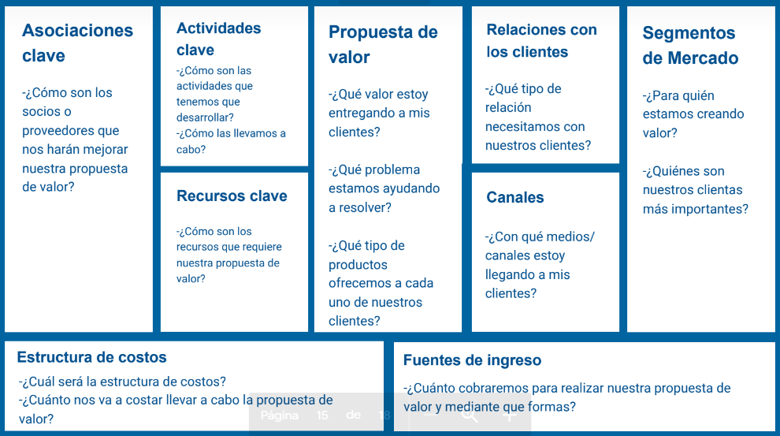

# Canvas
 - ¿Que es?
 > Es una herramienta de gestión estratégica que te 
   permiteconocer los aspectos clave de tu negocio: cómo se
   relacionan y compensan entre sí. Hace visible la 
   infraestructura, la oferta, los clientes y la situación
   financiera de tu organización para que logres reconocer las 
   deficiencias y analices el rendimiento.

1. Te permite identificar lo esencial
Con el modelo Canvas tienes una visión general de cuál es realmente tu modelo de negocio. También muestra qué actividades no son tan relevantes o incluso cuáles se interponen en el camino hacia tus objetivos. Lleva tu visión hacia lo esencial y de esta manera puedes optimizar tu modelo de negocio.

2. Te da la base para la lluvia de ideas
El modelo Canvas es el punto de partida perfecto para dejar que tus ideas y las de tu equipo fluyan libremente. También puedes probar modelos alternativos para complementar tu idea de negocio y encontrar nuevas posibilidades de comercialización.

3.  Te brinda una presentación estructurada
El modelo Canvas presenta en términos generales y visuales tu negocio, de una forma más clara y estructurada. Así otros podrán entender y discutir rápidamente tu modelo de negocio y todas las áreas de tu proyecto recibirán rápidamente la información que es importante para ellos y para la empresa.

4. Sienta la base de tus planes de negocios
El modelo Canvas no sustituye un plan de negocios detallado, pero con él obtienes una estructura que funcionará como el esqueleto de tu plan de negocios.

## Explorar Análisis

Diacnosticar
> Tambien conocido como Metodología de las 4C 
(Compañia, Categorías, Consumidores, Canales)

    - Financiero
    - Mercado
    - Comunicación

## Ventajas del canvas

- Herramientas Prácticas
    > Te permite modificar todo lo que quieras 
    sobre la misma a medida que vas avanzando 
    en su nálisis y también conforme va creciendo
    tu negocio o empresa.

- Sencillo e iterativo
    >El modelo canvas es muy sencillo, el formato de lienzo es
    muy intuitivo e iterativo.

- Trabajo en equipo
    >Te permite trabajar en equipo: trabajar en grupo de una
    manera muy interactiva y dinámica.

- Representación visual
    >Visualmente permite ver de manera global todos los
    aspectos importantes que configuran un modelo o plan de
    negocios.

## Segmentacion de Mercado

>Define los diferentes grupos de personas u
organizaciones que una proyecto apunta alcanzar y
servir.

>Un modelo de negocio puede definir uno o varios
segmentos de mercado, ya sean grandes o pequeños.

## Propuestas de Valor

>Describe el paquete de productos, servicios y/o
actividades que crean valor para un segmento de
clientes específico o público específico.

>Es la razón por la cual los clientes eligen una
opción en vez de otra. Soluciona un problema del
cliente o satisface una necesidad de mercado.

## Canales 
>Describe cómo la empresa/organización/iniciativa se
comunica y alcanza a sus segmentos de mercado
para entregar una propuesta de valor. Son puntos de
contacto que juegan un rol importante en la
experiencia del cliente.

## Relacion con los Clientes

>Describe los tipos de relaciones que una empresa/
organización/iniciativa establece con un
segmento específico de mercado.
El tipo de relación que exige el modelo de negocio
de una empresa repercute en gran medida en la
experiencia global del cliente.

## Fuentes de Ingreso

>Representa el dinero que la empresa/
organización/iniciativa genera de cada
segmento de mercado.
Si los clientes representan el corazón de un
modelo de negocios, las fuentes de ingreso son
sus arterias.

## Recursos Clave 

>Describe los activos más importantes requeridos
para hacer funcionar el modelo de negocios.
Cada modelo de negocio requiere recursos clave
diferentes.

## Actividad clave

>Describe las cosa más importantes que una
empresa/organización/iniciativa debe hacer para
que un modelo de negocios funcione.

## Asociaciones Clave

>Describe la red de proveedores/ socios/alianzas
que hacen que un modelo de negocios funcione.
Las empresas/organizaciones crean alianzas para
optimizar sus modelos de negocios, reducir el
riesgo o adquirir recursos.

## Estructuras de Costos

>Describe todos los costos incurridos para operar un
modelo de negocios.
Crear y entregar valor, mantener las relaciones con
los clientes, y generar ingresos. Todos incurren en
costos.

